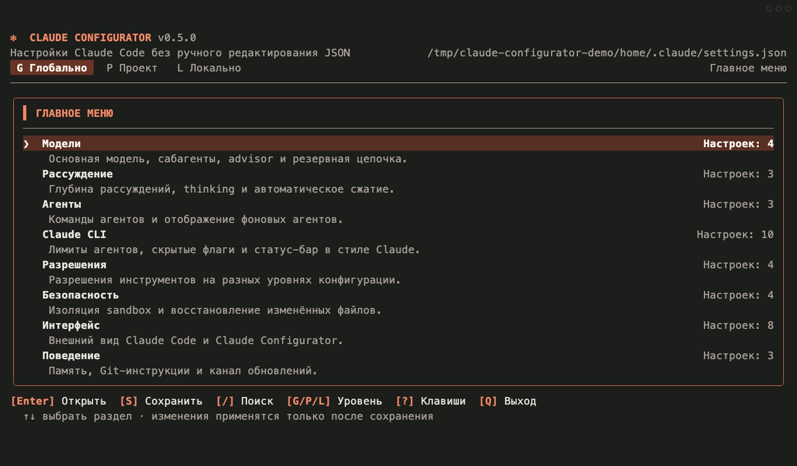
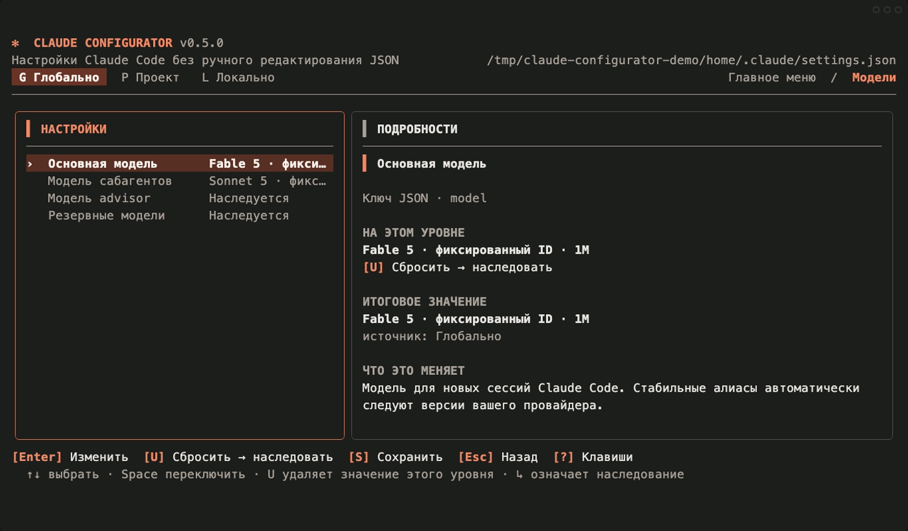
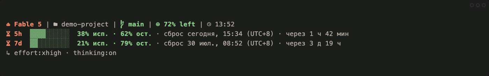
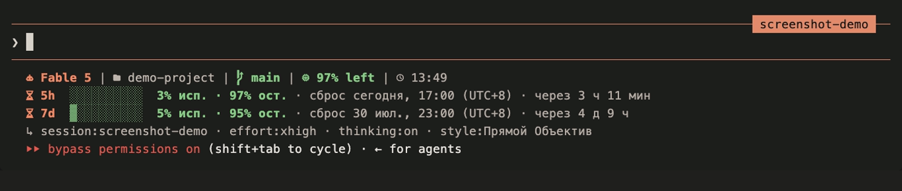

# Claude Configurator

[English](README.md) · [Русский](README.ru.md) · [简体中文](README.zh-CN.md)

[](https://github.com/ex3lite/claude-configurator/actions/workflows/ci.yml)
[](https://github.com/ex3lite/claude-configurator/releases)
[](LICENSE)

A fast terminal UI for editing Claude Code settings globally or per project. It
works locally, does not use prompts, and never sends your configuration
anywhere.



## Features

- Global, shared project, and local project scopes.
- Pickers for main, subagent, advisor, and fallback models; no raw typing for
  normal model selection.
- Current `fable`, `best`, `sonnet`, `opus`, and `haiku` aliases, plus an
  explicit **Default / inherit** action in every scoped picker.
- Reasoning, agents, permissions, sandbox, interface, and behavior settings.
- Typed controls for nested-agent depth, total/concurrent subagent caps, tool
  concurrency, interactive `/init`, and shared task lists.
- Claude-style status bar themes with live context, 5-hour/7-day allowance,
  exact local reset time, timezone, and countdowns.
- Automatic Nerd Font detection with an optional icon theme.
- Auto-localized TUI in English, Russian, or Simplified Chinese.
- Claude Code-inspired warm palette, clear title/subtitle hierarchy, and
  plain-language “what it controls / why you may need it” explanations.
- Persistent action bar with Save, hotkeys, inherited-value/source display,
  staged changes, and diff before save.
- Conflict detection, automatic backups, and protection against invalid JSON.
- Consent-based self-updates from verified GitHub Release assets.
- Git repository and worktree-aware paths.
- One native binary for macOS, Linux, and Windows.

## Install

### macOS or Linux

```sh
curl -fsSL https://raw.githubusercontent.com/ex3lite/claude-configurator/main/scripts/install.sh | sh
```

The installer verifies the release checksum and installs `claude-config`,
`claude-configurator`, and `ccfg` into `~/.local/bin`. If no Nerd Font is
detected, an interactive terminal offers to download the official MesloLGS
archive, verify its checksum, and install the Mono faces for the current user.

For a non-interactive font install:

```sh
curl -fsSL https://raw.githubusercontent.com/ex3lite/claude-configurator/main/scripts/install.sh |
  CLAUDE_CONFIG_INSTALL_NERD_FONT=1 sh
```

### Windows PowerShell

```powershell
irm https://raw.githubusercontent.com/ex3lite/claude-configurator/main/scripts/install.ps1 | iex
```

PowerShell offers the same verified current-user font install. Set
`$env:CLAUDE_CONFIG_INSTALL_NERD_FONT=1` before running it to opt in
non-interactively.

The installer can install and detect a font, but a child process cannot safely
change the font of its parent Terminal, iTerm2, Windows Terminal, or VS Code
session. Restart the terminal and select **MesloLGS Nerd Font Mono** once.
Claude Configurator then exposes **Claude Icons · Nerd Font v3**
automatically.

### Go

```sh
go install github.com/ex3lite/claude-configurator/cmd/claude-config@latest
```

Prebuilt archives and checksums are also available on the
[Releases page](https://github.com/ex3lite/claude-configurator/releases).

## Use

```text
claude-config
claude-config --scope global|project|local
claude-config --project /path/to/project
claude-config --no-update
claude-config statusline --theme auto|nerd|claude|ansi|mono
claude-config --help
claude-config --version
```

### Scopes

| Scope | File | Purpose |
|---|---|---|
| Global | `~/.claude/settings.json` | Your defaults for every project |
| Project | `.claude/settings.json` | Shared repository settings |
| Local | `.claude/settings.local.json` | Personal repository overrides |

Claude Code precedence is managed settings → CLI overrides → local → project →
global. Claude Configurator edits the last three levels and never changes
managed policy.

### Fable main model with Sonnet subagents

Select the global scope with `g`, open **Models**, and choose **Fable 5 · 1M**
for the main model and **Sonnet 5** for subagents. The resulting settings are:

```json
{
  "model": "claude-fable-5[1m]",
  "env": {
    "CLAUDE_CODE_SUBAGENT_MODEL": "claude-sonnet-5"
  }
}
```

Use `p` instead to apply the same values only to the current project. The
subagent setting applies to all subagents, agent teams, and workflow agents,
and overrides per-agent model choices. Restart already-running Claude Code
sessions after saving.

The picker includes Claude Code's current `default`, `best`, `fable`, `sonnet`,
`opus`, `haiku`, 1M-context, and `opusplan` aliases. Fable appears both as the
recommended `fable` alias and as a pinned preset. **Custom model ID…** remains
the last explicit option for gateways and provider-specific deployments;
ordinary model selection never opens a string field. See the
[official model configuration](https://code.claude.com/docs/en/model-config).



### Inheritance, reset, and save

The first item in a scoped picker is **Default / inherit**. It removes that
JSON key from the selected scope, so the value falls back to project, global,
managed, or Claude's own default resolution. It does not write a fake string.
The same action is always visible as **[U] Reset to inherit** in the details
panel and action bar.

Changes remain staged until **[S] Save**. Save is always visible, shows the
number of changed settings, and opens a diff before writing the file.

### Claude Code theme

Open **Interface → Theme** to choose Auto, dark, light, daltonized, or terminal
ANSI themes from a picker. Existing custom themes from `~/.claude/themes/*.json`
are added to the same list automatically; theme selection does not require
typing a string.

### Claude CLI controls

Open **Claude CLI** to configure the current
[official environment controls](https://code.claude.com/docs/en/env-vars):

| Setting | Claude default | Requirement |
|---|---:|---|
| Nested subagent depth | `1` | Claude Code 2.1.217+ |
| Total subagents per session | `200` | Claude Code 2.1.212+ |
| Concurrent subagents | `20` | Claude Code 2.1.217+ |
| Read-only tool/subagent concurrency | `10` | Current Claude Code |
| Interactive `/init` | Off | Enable with `CLAUDE_CODE_NEW_INIT=1` |
| Shared task list | Separate | Give sessions the same task-list ID |

Numeric settings use validated presets with an explicit custom-number option.
They are stored as strings under `env`, as Claude Code expects. Resetting a
setting removes the current scope's environment key and restores inheritance.

### Claude-style status bar

Choose **Claude CLI → Status bar theme** to install the built-in renderer:



```json
{
  "statusLine": {
    "type": "command",
    "command": "claude-config statusline --theme auto",
    "refreshInterval": 60
  }
}
```

The bar uses Claude Code's
[official status-line JSON](https://code.claude.com/docs/en/statusline) rather
than scraping terminal text. Each available 5-hour or 7-day window shows a
progress bar, used and remaining percentages, an exact reset date/time in the
system timezone, and a readable countdown. For example:
`today, 17:00 (UTC+8) · in 3h 23m`. Wider terminals combine both windows;
narrower terminals place them on separate rows. The first row also contains
the model, project, Git branch, remaining context, and local time. Session,
agent, effort, thinking, fast, Vim, and output-style state follow when present.

Themes are **Auto**, **Claude Icons** for Nerd Font v3, Claude clay true color,
terminal ANSI, and monochrome. The icon option appears only when Claude
Configurator detects a Nerd Font. Auto honors `NO_COLOR`. Rate-limit fields
are available only to Claude.ai Pro/Max subscribers after the first API
response. Until Claude provides them, the bar explicitly says that it is
waiting; it never invents a percentage or reset date.
Resetting **Status bar theme** removes the entire `statusLine` override from
the selected scope so the lower scope is inherited.

Real Claude Code input bar captured automatically in an isolated
`demo-project`:



### Interface language

The TUI starts in **Auto** mode and follows the operating system language.
Open **Interface → Interface language** to choose Auto, English, Русский, or
简体中文. This preference is saved in the operating system's user configuration
directory for Claude Configurator and is not written to Claude Code settings.

### Automatic updates

Release binaries check the latest stable
[GitHub Release](https://github.com/ex3lite/claude-configurator/releases) when
the TUI starts. If a newer version exists, a localized dialog asks before
anything is downloaded. Accepting it downloads only the archive for the
current operating system and `checksums.txt`, verifies SHA-256, replaces the
running binary safely, and restarts Claude Configurator. Choosing **Later**
continues with the installed version.

The updater follows published releases, never the repository's `main` branch.
`--help` and `--version` do not access the network. Use `--no-update` for one
launch or set `CLAUDE_CONFIG_NO_UPDATE=1` to disable checks in scripts and
offline environments. Builds produced by `go install` report `dev` and stay
under Go's package-management flow instead of replacing themselves.

### Keyboard

| Key | Action |
|---|---|
| `↑/↓`, `j/k` | Select an item in the current screen |
| `Enter` | Open a category or edit a setting |
| `Esc`, `←` | Return to the main menu |
| `g`, `p`, `l` | Global, project, local scope |
| `Space` | Toggle a boolean |
| `/` | Search |
| `u` | Remove this scope's value and inherit |
| `s` | Review diff and save |
| `r` | Reload from disk |
| `?` | Help |
| `q` | Quit |

## Safety and privacy

- Existing files are checked again before save; external changes block the
  write instead of being overwritten.
- Invalid JSON is never replaced. The error includes the file, line, and
  column.
- Existing unknown settings are preserved.
- Backups are stored under the operating system's user cache directory in
  `claude-configurator/backups`; the latest 10 backups per file are retained.
- Global and local files default to owner-only permissions.
- Dangerous settings such as `bypassPermissions` require a second
  confirmation.
- No telemetry, analytics, or account access. The only automatic network
  request is the startup check for public GitHub Release metadata; settings
  files and their values never leave the computer.

## Troubleshooting

- Settings are not active: restart Claude Code and check `/status`; managed
  settings or command-line flags may have higher precedence.
- Startup reports invalid JSON: fix the exact location printed by
  `claude-config`, then run `claude doctor`.
- A save is blocked: another process changed the file; press `r`, review the
  new value, and apply your change again.
- Colors are unwanted: start with `NO_COLOR=1 claude-config`.
- Status limits are absent: make one Claude request first; Claude exposes these
  fields only for supported Claude.ai Pro/Max subscriptions.
- The icon theme is absent: install a Nerd Font, restart the terminal, and
  reopen Claude Configurator. Detection is automatic.
- The status bar does not start: ensure `claude-config` is on the `PATH` seen
  by Claude Code, then select the theme again.
- An update cannot be installed: ensure the directory containing
  `claude-config` is writable, or rerun the installation script.

## Development

Requires Go 1.25+.

```sh
go test -race ./...
go vet ./...
go run ./cmd/claude-config
./scripts/update-screenshots.sh
```

The screenshot script builds the current TUI, records deterministic real
terminal sessions with [VHS](https://github.com/charmbracelet/vhs), and checks
that Claude-orange accents are present. When an installed Claude Code session
is available, it also captures the real input bar inside a temporary
`demo-project`; the published crop never includes the welcome panel, account,
or home path. Live capture sends one minimal `Reply only: OK` request so Claude
supplies its official rate-limit fields; set `CLAUDE_CONFIG_CAPTURE_LIVE=0` to
skip it. The `Refresh screenshots` workflow runs on every `main` update and
commits changed deterministic PNG files automatically.

Claude Configurator is an independent community project and is not affiliated
with or endorsed by Anthropic. Claude is a trademark of Anthropic.
