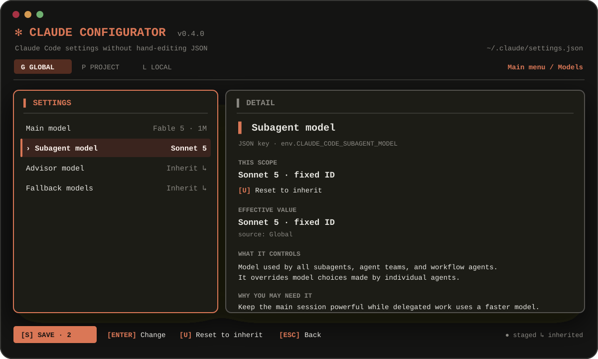
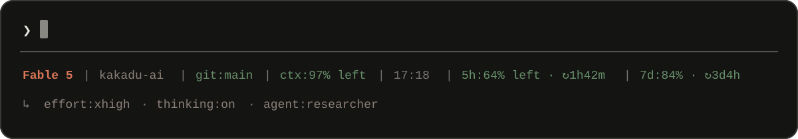

# Claude Configurator

[English](README.md) · [Русский](README.ru.md) · [简体中文](README.zh-CN.md)

[](https://github.com/ex3lite/claude-configurator/actions/workflows/ci.yml)
[](https://github.com/ex3lite/claude-configurator/releases)
[](LICENSE)

Быстрый терминальный интерфейс для глобальной и проектной настройки Claude
Code. Работает локально, не использует промпты и никуда не отправляет
конфигурацию.



## Возможности

- Глобальные, общие проектные и локальные проектные настройки.
- Списки выбора основной модели, модели сабагентов, advisor и fallback-цепочки
  без ручного ввода для обычных моделей.
- Актуальные алиасы `fable`, `best`, `sonnet`, `opus` и `haiku`, а также явный
  пункт **По умолчанию / наследовать** в каждом picker для уровней.
- Reasoning, агенты, permissions, sandbox, интерфейс и поведение.
- Типизированные настройки глубины вложенных агентов, общего и одновременного
  лимита сабагентов, параллельности tools, интерактивного `/init` и общего task
  list.
- Статус-бар в стиле Claude с остатком контекста, реальными окнами 5h/7d и
  временем до их сброса.
- Автолокализация TUI на английский, русский или упрощённый китайский.
- Тёплая палитра Claude Code, чёткое разделение заголовков и подзаголовков,
  понятные объяснения «что меняет» и «зачем нужно».
- Постоянная панель действий с кнопкой сохранения, хоткеями, наследованием,
  staged-изменениями и diff.
- Защита от конфликтов, автоматические бэкапы и отказ перезаписывать невалидный
  JSON.
- Самообновление из проверенных GitHub Releases только после подтверждения.
- Корректная работа с Git-репозиториями и worktree.
- Один нативный бинарник для macOS, Linux и Windows.

## Установка

### macOS или Linux

```sh
curl -fsSL https://raw.githubusercontent.com/ex3lite/claude-configurator/main/scripts/install.sh | sh
```

Установщик проверяет checksum релиза и устанавливает команды `claude-config`,
`claude-configurator` и `ccfg` в `~/.local/bin`.

### Windows PowerShell

```powershell
irm https://raw.githubusercontent.com/ex3lite/claude-configurator/main/scripts/install.ps1 | iex
```

### Через Go

```sh
go install github.com/ex3lite/claude-configurator/cmd/claude-config@latest
```

Готовые архивы и checksums находятся на
[странице релизов](https://github.com/ex3lite/claude-configurator/releases).

## Использование

```text
claude-config
claude-config --scope global|project|local
claude-config --project /путь/к/проекту
claude-config --no-update
claude-config statusline --theme auto|claude|ansi|mono
claude-config --help
claude-config --version
```

### Уровни настроек

| Уровень | Файл | Назначение |
|---|---|---|
| Global | `~/.claude/settings.json` | Ваши настройки для всех проектов |
| Project | `.claude/settings.json` | Общие настройки репозитория |
| Local | `.claude/settings.local.json` | Личные переопределения проекта |

Приоритет Claude Code: managed → аргументы CLI → local → project → global.
Claude Configurator редактирует последние три уровня и не меняет
организационные политики.

### Fable как основная модель, Sonnet для сабагентов

Переключитесь на global клавишей `g`, откройте **Модели** и выберите
**Fable 5 · 1M** для основной модели и **Sonnet 5** для сабагентов. Получится:

```json
{
  "model": "claude-fable-5[1m]",
  "env": {
    "CLAUDE_CODE_SUBAGENT_MODEL": "claude-sonnet-5"
  }
}
```

Для настройки только текущего проекта используйте `p`. Модель сабагентов
применяется ко всем сабагентам, agent teams и workflow-агентам и имеет
приоритет над выбором модели внутри отдельного агента. После сохранения
перезапустите уже работающие сессии Claude Code.

В picker доступны актуальные алиасы Claude Code: `default`, `best`, `fable`,
`sonnet`, `opus`, `haiku`, варианты с контекстом 1M и `opusplan`. Fable
показывается как рекомендуемый алиас `fable` и как фиксированный preset.
Последний пункт **Другая модель…** оставлен только для gateway и
provider-конфигураций; обычный выбор модели больше не открывает строковое поле.
Подробнее — в
[официальной документации моделей](https://code.claude.com/docs/en/model-config).

### Наследование, сброс и сохранение

Первый пункт любого picker для уровней — **По умолчанию / наследовать**. Он
удаляет JSON-ключ именно с выбранного уровня, после чего используется project,
global, managed или стандартное разрешение Claude. Фиктивная строка
«по умолчанию» в файл не записывается. То же действие всегда видно как
**[U] Сбросить → наследовать** в подробностях и нижней панели.

Изменения остаются staged до нажатия **[S] Сохранить**. Кнопка всегда видна,
показывает количество изменений и открывает diff перед записью.

### Тема Claude Code

Откройте **Интерфейс → Тема Claude Code**, чтобы выбрать Авто, тёмную,
светлую, daltonized или ANSI-тему терминала из списка. Существующие темы из
`~/.claude/themes/*.json` автоматически добавляются туда же; вручную писать
название темы не нужно.

### Настройки Claude CLI

Откройте отдельный раздел **Claude CLI** с
[официальными переменными окружения](https://code.claude.com/docs/en/env-vars):

| Настройка | Значение Claude | Требование |
|---|---:|---|
| Глубина вложенных сабагентов | `1` | Claude Code 2.1.217+ |
| Всего сабагентов за сессию | `200` | Claude Code 2.1.212+ |
| Одновременно работающих сабагентов | `20` | Claude Code 2.1.217+ |
| Параллельность read-only tools и сабагентов | `10` | Актуальный Claude Code |
| Интерактивный `/init` | Выключен | `CLAUDE_CODE_NEW_INIT=1` |
| Общий task list | Раздельный | Одинаковый ID в нужных сессиях |

Числа выбираются из проверенных presets; для нестандартного лимита есть явный
пункт **Другое значение…** с валидацией. В `env` они записываются строками, как
ожидает Claude Code. Сброс удаляет переменную с текущего уровня и возвращает
наследование.

### Статус-бар в стиле Claude

Выберите **Claude CLI → Тема статус-бара**. Конфигуратор запишет:



```json
{
  "statusLine": {
    "type": "command",
    "command": "claude-config statusline --theme auto",
    "refreshInterval": 60
  }
}
```

Панель использует
[официальный JSON status line](https://code.claude.com/docs/en/statusline)
Claude Code, а не парсит терминал. Она показывает модель, проект, Git-ветку, остаток контекста, локальное
время, реальный остаток лимитов 5h/7d и countdown до сброса. Вторая строка при
наличии данных показывает session, agent, effort, thinking, fast, Vim и output
style.

Доступны темы **Авто**, Claude clay true color, ANSI-палитра терминала и
монохром. Авто учитывает `NO_COLOR`; на узком терминале сначала исчезают
второстепенные сегменты. `rate_limits` Claude отдаёт только подписчикам
Claude.ai Pro/Max после первого API-ответа, поэтому отсутствующие окна не
подменяются выдуманными числами. **Сбросить → наследовать** у темы удаляет весь
override `statusLine` на выбранном уровне.

### Язык интерфейса

По умолчанию включён режим **Авто**, который следует языку операционной
системы. В разделе **Интерфейс → Язык интерфейса** доступны Авто, English,
Русский и 简体中文. Выбор хранится в пользовательском config-каталоге ОС отдельно
от настроек Claude Code.

### Автоматическое обновление

Релизный бинарник при запуске TUI проверяет последний стабильный
[GitHub Release](https://github.com/ex3lite/claude-configurator/releases). Если
версия новее, локализованное окно сначала запрашивает разрешение. Только после
согласия скачиваются архив для текущей ОС и `checksums.txt`, проверяется
SHA-256, безопасно заменяется текущий бинарник и Claude Configurator
перезапускается. Кнопка **Позже** продолжает работу на установленной версии.

Проверяются только опубликованные релизы, а не ветка `main`. Команды `--help`
и `--version` не обращаются к сети. Для одного запуска используйте
`--no-update`, а для скриптов и offline-окружений —
`CLAUDE_CONFIG_NO_UPDATE=1`. Сборки из `go install` имеют версию `dev` и
обновляются через Go, не заменяя себя самостоятельно.

### Клавиши

| Клавиша | Действие |
|---|---|
| `↑/↓`, `j/k` | Выбор пункта на текущем экране |
| `Enter` | Открыть раздел или изменить настройку |
| `Esc`, `←` | Вернуться в главное меню |
| `g`, `p`, `l` | Global, project, local |
| `Space` | Переключить boolean |
| `/` | Поиск |
| `u` | Удалить значение этого уровня и наследовать |
| `s` | Посмотреть diff и сохранить |
| `r` | Перечитать файлы |
| `?` | Справка |
| `q` | Выход |

## Безопасность и приватность

- Перед записью файл проверяется повторно. Внешнее изменение блокирует
  сохранение, а не перезаписывается.
- Невалидный JSON не заменяется; ошибка содержит файл, строку и столбец.
- Неизвестные приложению настройки сохраняются.
- Бэкапы хранятся в пользовательском cache-каталоге ОС в
  `claude-configurator/backups`; остаются последние 10 копий каждого файла.
- Новые global и local файлы доступны только владельцу.
- Опасные значения вроде `bypassPermissions` требуют второго подтверждения.
- Нет телеметрии, аналитики и доступа к аккаунту. Единственный автоматический
  сетевой запрос — проверка публичных метаданных GitHub Release при запуске;
  файлы настроек и их значения компьютер не покидают.

## Решение проблем

- Настройка не применяется: перезапустите Claude Code и проверьте `/status`;
  managed-политика или аргумент CLI могут иметь больший приоритет.
- Ошибка JSON: исправьте указанную `claude-config` позицию и запустите
  `claude doctor`.
- Сохранение заблокировано: файл изменил другой процесс. Нажмите `r`, проверьте
  новое значение и повторите изменение.
- Не нужны цвета: запустите `NO_COLOR=1 claude-config`.
- Лимитов в статус-баре нет: сначала отправьте один запрос Claude; поля
  доступны только для поддерживаемых подписок Claude.ai Pro/Max.
- Статус-бар не запускается: проверьте, что `claude-config` доступен в `PATH`
  процесса Claude Code, затем выберите тему повторно.
- Обновление не устанавливается: проверьте права записи в каталог с
  `claude-config` или повторно запустите установочный скрипт.

## Разработка

Требуется Go 1.25+.

```sh
go test -race ./...
go vet ./...
go run ./cmd/claude-config
```

Claude Configurator — независимый проект сообщества, не связанный с Anthropic
и не одобренный компанией. Claude является товарным знаком Anthropic.
