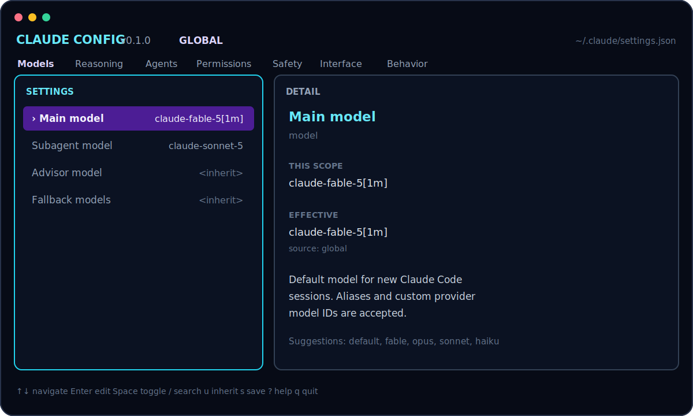

# Claude Configurator

[English](README.md) · [Русский](README.ru.md) · [简体中文](README.zh-CN.md)

[](https://github.com/ex3lite/claude-configurator/actions/workflows/ci.yml)
[](https://github.com/ex3lite/claude-configurator/releases)
[](LICENSE)

一个快速的终端界面，用于全局或按项目编辑 Claude Code 设置。它完全在本地运行，
不依赖提示词，也不会将配置发送到任何地方。



## 功能

- 支持全局、项目共享和项目本地三个作用域。
- 使用选择器配置主模型、子代理模型、Advisor 模型和回退模型链；
  常规模型无需手动输入。
- 配置推理、代理、权限、沙箱、界面和行为。
- TUI 可按系统语言自动切换英语、俄语或简体中文。
- 支持搜索、继承值与来源显示、暂存修改和保存前 diff。
- 检测写入冲突、自动备份，并拒绝覆盖无效 JSON。
- 正确识别 Git 仓库和 worktree。
- 为 macOS、Linux 和 Windows 提供单一原生二进制文件。

## 安装

### macOS 或 Linux

```sh
curl -fsSL https://raw.githubusercontent.com/ex3lite/claude-configurator/main/scripts/install.sh | sh
```

安装脚本会验证发布文件的校验和，并将 `claude-config`、
`claude-configurator` 和 `ccfg` 安装到 `~/.local/bin`。

### Windows PowerShell

```powershell
irm https://raw.githubusercontent.com/ex3lite/claude-configurator/main/scripts/install.ps1 | iex
```

### 使用 Go

```sh
go install github.com/ex3lite/claude-configurator/cmd/claude-config@latest
```

也可以从[发布页面](https://github.com/ex3lite/claude-configurator/releases)
下载预编译压缩包和 checksums。

## 使用

```text
claude-config
claude-config --scope global|project|local
claude-config --project /path/to/project
claude-config --help
claude-config --version
```

### 作用域

| 作用域 | 文件 | 用途 |
|---|---|---|
| Global | `~/.claude/settings.json` | 所有项目的个人默认设置 |
| Project | `.claude/settings.json` | 仓库共享设置 |
| Local | `.claude/settings.local.json` | 当前仓库的个人覆盖设置 |

Claude Code 的优先级为：托管设置 → CLI 参数 → local → project → global。
Claude Configurator 只编辑后三层，不修改组织托管策略。

### 使用 Fable 主模型和 Sonnet 子代理

按 `g` 选择 global 作用域，打开**模型**，为主模型选择
**Fable 5 · 1M**，为子代理选择 **Sonnet 5**。生成的设置为：

```json
{
  "model": "claude-fable-5[1m]",
  "env": {
    "CLAUDE_CODE_SUBAGENT_MODEL": "claude-sonnet-5"
  }
}
```

如需仅应用于当前项目，请使用 `p`。子代理设置会应用于所有子代理、
agent teams 和 workflow agents，并覆盖单个代理内的模型选择。保存后请重启
已经运行的 Claude Code 会话。

选择器包含 Claude Code 稳定别名：`default`、`best`、`sonnet`、`opus`、
`haiku`、1M 上下文选项和 `opusplan`。最后的**自定义模型 ID…**仅用于
gateway 或提供商特定部署；常规模型选择不会再打开字符串输入框。详见
[官方模型配置文档](https://code.claude.com/docs/en/model-config)。

### 界面语言

TUI 默认使用**自动**模式并跟随操作系统语言。在
**界面 → 界面语言**中可以选择自动、English、Русский 或简体中文。
该偏好保存在操作系统的 Claude Configurator 用户配置目录中，不会写入
Claude Code 设置。

### 快捷键

| 按键 | 操作 |
|---|---|
| `↑/↓`、`j/k` | 在当前界面选择项目 |
| `Enter` | 打开分类或编辑设置 |
| `Esc`、`←` | 返回主菜单 |
| `g`、`p`、`l` | Global、project、local |
| `Space` | 切换布尔值 |
| `/` | 搜索 |
| `u` | 删除当前值并继承 |
| `s` | 查看 diff 并保存 |
| `r` | 从磁盘重新加载 |
| `?` | 帮助 |
| `q` | 退出 |

## 安全与隐私

- 保存前会再次检查文件；如果文件被外部修改，将阻止写入而不是覆盖。
- 永远不会替换无效 JSON；错误会显示文件、行和列。
- 保留应用不认识的现有设置。
- 备份位于操作系统用户缓存目录下的 `claude-configurator/backups`，
  每个文件保留最近 10 份。
- 新建的 global 和 local 文件默认仅所有者可访问。
- `bypassPermissions` 等危险设置需要二次确认。
- 无遥测、无分析、无账户访问，运行时无网络请求。

## 故障排除

- 设置未生效：重启 Claude Code 并检查 `/status`；托管设置或 CLI 参数可能
  具有更高优先级。
- JSON 无效：修复 `claude-config` 显示的位置，然后运行 `claude doctor`。
- 保存被阻止：其他进程修改了文件。按 `r` 重新加载，检查后再次修改。
- 不需要颜色：使用 `NO_COLOR=1 claude-config` 启动。

## 开发

需要 Go 1.25 或更高版本。

```sh
go test -race ./...
go vet ./...
go run ./cmd/claude-config
```

Claude Configurator 是独立的社区项目，与 Anthropic 无关联，也未获得其认可。
Claude 是 Anthropic 的商标。
