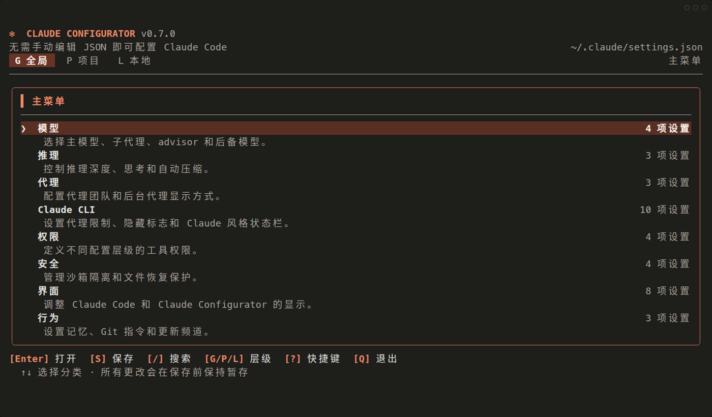
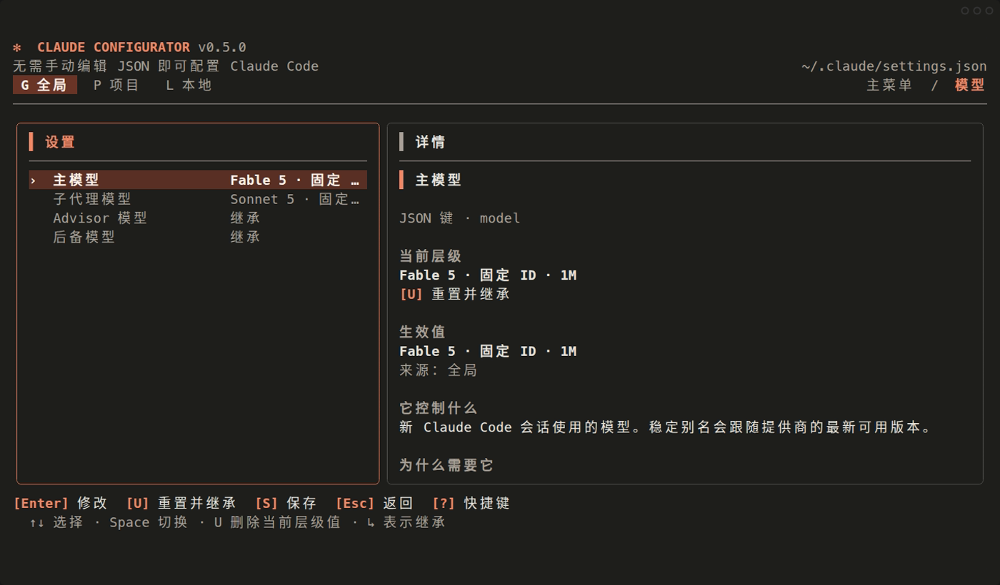
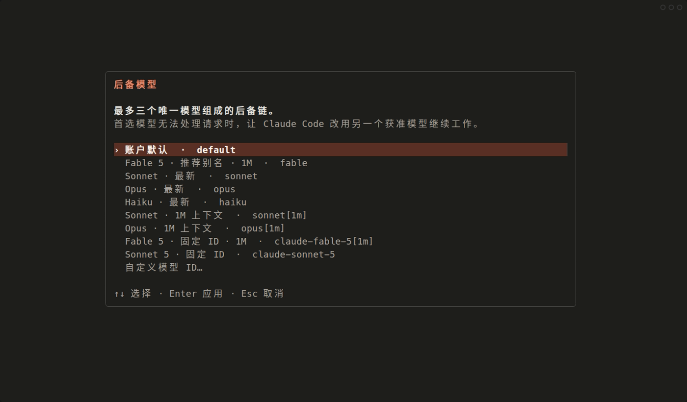
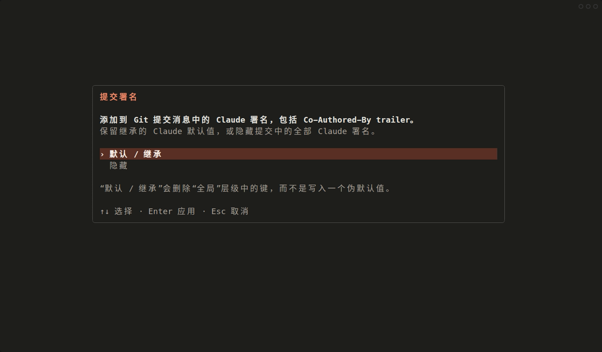
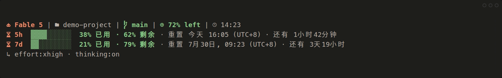
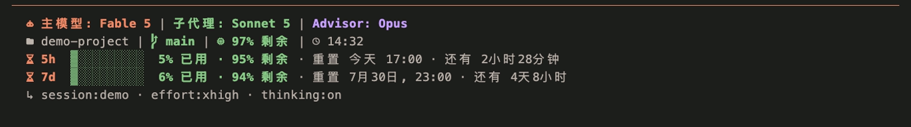

# Claude Configurator

[English](README.md) · [Русский](README.ru.md) · [简体中文](README.zh-CN.md)

[](https://github.com/ex3lite/claude-configurator/actions/workflows/ci.yml)
[](https://github.com/ex3lite/claude-configurator/releases)
[](LICENSE)

一个快速的终端界面，用于全局或按项目编辑 Claude Code 设置。它完全在本地运行，
不依赖提示词，也不会将配置发送到任何地方。



## 安装

### macOS 或 Linux

```sh
curl -fsSL https://raw.githubusercontent.com/ex3lite/claude-configurator/main/scripts/install.sh | sh
```

安装脚本会验证发布文件的校验和，并将 `claude-config`、
`claude-configurator` 和 `ccfg` 安装到 `~/.local/bin`。如果未检测到
Nerd Font，交互式安装还会询问是否下载官方 MesloLGS 压缩包、验证其
校验和，并为当前用户安装 Mono 字体。

无需交互即可安装字体：

```sh
curl -fsSL https://raw.githubusercontent.com/ex3lite/claude-configurator/main/scripts/install.sh |
  CLAUDE_CONFIG_INSTALL_NERD_FONT=1 sh
```

### Windows PowerShell

```powershell
irm https://raw.githubusercontent.com/ex3lite/claude-configurator/main/scripts/install.ps1 | iex
```

PowerShell 提供同样的已验证用户级字体安装。提前设置
`$env:CLAUDE_CONFIG_INSTALL_NERD_FONT=1` 即可无交互启用。

安装器可以自动安装并检测字体，但子进程无法安全修改已打开的 Terminal、
iTerm2、Windows Terminal 或 VS Code 会话字体。请重启终端并选择一次
**MesloLGS Nerd Font Mono**；随后 **Claude 图标 · Nerd Font v3**
会自动解锁。

### 使用 Go

```sh
go install github.com/ex3lite/claude-configurator/cmd/claude-config@latest
```

也可以从[发布页面](https://github.com/ex3lite/claude-configurator/releases)
下载预编译压缩包和 checksums。

两个安装脚本都会验证下载的压缩包和最终安装的二进制文件。如果目标目录不在
`PATH` 中，脚本会显示适用于当前 shell 的准确命令，不会静默修改 shell
配置文件。

### 卸载

macOS/Linux 默认安装：

```sh
rm -f "$HOME/.local/bin/claude-config" \
  "$HOME/.local/bin/claude-configurator" \
  "$HOME/.local/bin/ccfg"
```

Windows 默认安装：

```powershell
Remove-Item "$env:LOCALAPPDATA\Programs\claude-configurator" -Recurse -Force
```

这些命令只删除应用程序；Claude Code 设置、Configurator 备份和可选安装的
Nerd Font 都会保留。

## 三项核心能力

- **无需提示词即可路由模型：**从类型化列表中选择主模型、子代理模型、
  Advisor 模型和回退模型。
- **安全控制优先级：**编辑 global、项目共享或项目本地设置，同时查看最终值
  及其来源。
- **查看当前会话：**安装 Claude 风格状态栏，显示模型角色、剩余上下文、
  限额窗口、本地重置时间和倒计时。

| 任务 | 手动编辑 JSON | Claude Configurator |
|---|---|---|
| 选择模型 | 记住键名和模型 ID | 本地化类型选择器 |
| 处理作用域 | 手动比较三个文件 | 显示最终值和来源 |
| 取消覆盖 | 精确且安全地删除键 | **重置并继承** |
| 安全保存 | 默认没有冲突检查或备份 | Diff、冲突检查、原子写入和备份 |

## 快速开始

```text
claude-config
claude-config --scope global|project|local
claude-config --project /path/to/project
claude-config --no-update
claude-config statusline --theme auto|nerd|claude|ansi|mono
claude-config --help
claude-config --version
```

## 功能

- 支持全局、项目共享和项目本地三个作用域。
- 使用选择器配置主模型、子代理模型、Advisor 模型和回退模型链；
  常规模型无需手动输入。
- 包含当前 `fable`、`best`、`sonnet`、`opus` 和 `haiku` 别名，并在
  每个分层选择器中提供明确的**默认 / 继承**选项。
- 为 `permissions.allow`、`ask` 和 `deny` 提供本地化预设，并在选择前
  显示准确的 Claude Code 规则。
- 配置推理、代理、权限、沙箱、界面和行为。
- 分别控制提交、pull request 和 Claude 会话链接署名。
- 使用类型化控件设置嵌套代理深度、子代理总数/并发数、工具并发、
  交互式 `/init` 和共享任务列表。
- Claude 风格状态栏分别显示主模型、子代理模型和 advisor，并显示剩余上下文、
  真实 5 小时/7 天限额、本地重置时间和倒计时。
- 自动检测 Nerd Font，并按检测结果解锁图标主题。
- TUI 可按系统语言自动切换英语、俄语或简体中文。
- 固定操作栏会一直显示保存、快捷键、继承来源、暂存修改和保存前 diff。
- 检测写入冲突、自动备份，并拒绝覆盖无效 JSON。
- 仅在用户确认后，从已验证的 GitHub Release 进行自更新。
- 正确识别 Git 仓库和 worktree。
- 为 macOS、Linux 和 Windows 提供单一原生二进制文件。

## 配置指南

### 作用域

| 作用域 | 文件 | 用途 |
|---|---|---|
| Global | `~/.claude/settings.json` | 所有项目的个人默认设置 |
| Project | `.claude/settings.json` | 仓库共享设置 |
| Local | `.claude/settings.local.json` | 当前仓库的个人覆盖设置 |

Claude Code 的优先级为：托管设置 → CLI 参数 → local → project → global。
Claude Configurator 只编辑后三层，不修改组织托管策略。

### 使用 Fable 主模型和 Sonnet 子代理

按 `g` 选择 global 作用域，打开**模型**，为主模型选择
**Fable 5 · 1M**，为子代理选择 **Sonnet 5**。生成的设置为：

```json
{
  "model": "claude-fable-5[1m]",
  "env": {
    "CLAUDE_CODE_SUBAGENT_MODEL": "claude-sonnet-5"
  }
}
```

如需仅应用于当前项目，请使用 `p`。子代理设置会应用于所有子代理、
agent teams 和 workflow agents，并覆盖单个代理内的模型选择。保存后请重启
已经运行的 Claude Code 会话。

选择器包含 Claude Code 当前别名：`default`、`best`、`fable`、
`sonnet`、`opus`、`haiku`、1M 上下文选项和 `opusplan`。Fable 同时
提供推荐的 `fable` 别名和固定预设。最后的**自定义模型 ID…**仅用于
gateway 或提供商特定部署；常规模型选择不会打开字符串输入框。详见
[官方模型配置文档](https://code.claude.com/docs/en/model-config)。



### 后备模型与权限列表

打开空的后备模型链或权限列表时，现在会直接显示实用选项，不再进入空白编辑器。
后备模型包含账户默认值、Fable、Sonnet、Opus、Haiku 和自定义提供商 ID。
权限预设使用 Claude Code 的 `Tool` / `Tool(specifier)` 语法，并始终显示
原始规则；项目专用规则仍可通过**自定义值…**输入。



### 继承、重置与保存

分层选择器的第一项是**默认 / 继承**。它会删除当前作用域中的 JSON 键，
随后回退到 project、global、managed 或 Claude 自身的默认解析；不会写入
一个伪默认字符串。详情面板和底部操作栏也会始终显示
**[U] 重置并继承**。

所有更改在按下 **[S] 保存**前保持暂存。保存按钮始终可见，会显示更改
数量，并在写入前打开 diff。

### Git 署名

在**行为**分类中可以配置当前三项
[Claude Code 署名设置](https://code.claude.com/docs/en/settings#attribution-settings)。
将提交署名和 pull request 署名设为**隐藏**，再关闭会话链接，即可移除
全部内置署名：

```json
{
  "attribution": {
    "commit": "",
    "pr": "",
    "sessionUrl": false
  }
}
```

选择**默认 / 继承**会删除对应键并恢复作用域继承。Configurator 不会写入
已弃用的 `includeCoAuthoredBy`。



### Claude Code 主题

打开**界面 → Claude Code 主题**，即可从列表选择自动、深色、浅色、
色觉友好或终端 ANSI 主题。`~/.claude/themes/*.json` 中已有的自定义主题
也会自动加入列表，无需手动输入主题名。

### Claude CLI 设置

打开独立的 **Claude CLI** 分类，配置
[官方环境变量](https://code.claude.com/docs/en/env-vars)：

| 设置 | Claude 默认值 | 要求 |
|---|---:|---|
| 嵌套子代理深度 | `1` | Claude Code 2.1.217+ |
| 每会话子代理总数 | `200` | Claude Code 2.1.212+ |
| 并发子代理数 | `20` | Claude Code 2.1.217+ |
| 只读工具与子代理并发数 | `10` | 当前 Claude Code |
| 交互式 `/init` | 关闭 | `CLAUDE_CODE_NEW_INIT=1` |
| 共享任务列表 | 独立 | 在会话中使用相同 ID |

数字通过已验证的预设选择；非标准限制可选择**自定义值…**并进行校验。
它们会按 Claude Code 的要求作为字符串写入 `env`。重置会删除当前作用域
中的环境变量并恢复继承。

### Claude 风格状态栏

选择 **Claude CLI → 状态栏主题**后会写入：



```json
{
  "statusLine": {
    "type": "command",
    "command": "claude-config statusline --theme auto",
    "refreshInterval": 60
  }
}
```

状态栏读取 Claude Code
[官方 status-line JSON](https://code.claude.com/docs/en/statusline)，而不是
抓取终端文本。每个可用的 5 小时/7 天窗口都会显示进度条、已用与剩余百分比、
按设备本地时区转换的精确重置日期和时间，以及易读倒计时，例如：
`今天 17:00 · 还有 3小时23分钟`。时间已经转换为本地时间，因此不再显示
多余的时区后缀。独立的首行显示当前会话报告的主模型，以及按照
global → project → local 继承得到的子代理和 advisor 模型。下一行显示项目、
Git 分支、剩余上下文和本地时间。宽终端会并排显示两个限制窗口，窄终端则
分行显示；有数据时继续显示 session、agent、effort、thinking、fast、Vim
和输出风格。

提供**自动**、适用于 Nerd Font v3 的 **Claude 图标**、Claude clay 真彩色、
终端 ANSI 和单色主题。只有检测到 Nerd Font 后才显示图标选项；自动模式遵循
`NO_COLOR`。Claude.ai Pro/Max 在首次 API 响应后才提供 `rate_limits`。
在此之前，状态栏会明确显示正在等待数据，绝不会伪造百分比或重置日期。
重置**状态栏主题**会删除当前作用域的整个 `statusLine` 覆盖并恢复继承。

以下是真实 Claude Code input bar，由脚本在隔离的 `demo-project` 中自动截取：



### 界面语言

TUI 默认使用**自动**模式并跟随操作系统语言。在
**界面 → 界面语言**中可以选择自动、English、Русский 或简体中文。
该偏好保存在操作系统的 Claude Configurator 用户配置目录中，不会写入
Claude Code 设置。

### 自动更新

正式发布的二进制文件会在 TUI 启动时检查最新稳定版
[GitHub Release](https://github.com/ex3lite/claude-configurator/releases)。
发现新版本后，会先显示本地化确认窗口；只有同意后才会下载当前系统的压缩包
和 `checksums.txt`，验证 SHA-256，安全替换当前程序并自动重启。选择
**稍后**会继续使用已安装版本。

更新器只跟踪已发布版本，不跟踪仓库的 `main` 分支。`--help` 和
`--version` 不会访问网络。单次启动可使用 `--no-update`；脚本或离线环境
可设置 `CLAUDE_CONFIG_NO_UPDATE=1`。通过 `go install` 构建的版本显示为
`dev`，继续由 Go 的包管理流程更新，不会自行替换。

### 快捷键

| 按键 | 操作 |
|---|---|
| `↑/↓`、`j/k` | 在当前界面选择项目 |
| `Enter` | 打开分类或编辑设置 |
| `Esc`、`←` | 返回主菜单 |
| `g`、`p`、`l` | Global、project、local |
| `Space` | 切换布尔值 |
| `/` | 搜索 |
| `u` | 删除当前作用域的值并继承 |
| `s` | 查看 diff 并保存 |
| `r` | 从磁盘重新加载 |
| `?` | 帮助 |
| `q` | 退出 |

## 安全与隐私

- 保存前会再次检查文件；如果文件被外部修改，将阻止写入而不是覆盖。
- 永远不会替换无效 JSON；错误会显示文件、行和列。
- 保留应用不认识的现有设置。
- 备份位于操作系统用户缓存目录下的 `claude-configurator/backups`，
  每个文件保留最近 10 份。
- 新建的 global 和 local 文件默认仅所有者可访问。
- `bypassPermissions` 等危险设置需要二次确认。
- 无遥测、无分析、无账户访问。唯一的自动网络请求是启动时读取公开的
  GitHub Release 元数据；设置文件及其内容不会离开本机。

## 故障排除

- 设置未生效：重启 Claude Code 并检查 `/status`；托管设置或 CLI 参数可能
  具有更高优先级。
- JSON 无效：修复 `claude-config` 显示的位置，然后运行 `claude doctor`。
- 保存被阻止：其他进程修改了文件。按 `r` 重新加载，检查后再次修改。
- 不需要颜色：使用 `NO_COLOR=1 claude-config` 启动。
- 状态栏没有限额：先发送一次 Claude 请求；这些字段只对受支持的
  Claude.ai Pro/Max 订阅可用。
- 未显示图标主题：安装 Nerd Font，重启终端并重新打开 Claude
  Configurator；检测会自动进行。
- 状态栏未启动：确认 Claude Code 进程的 `PATH` 中可以找到
  `claude-config`，然后重新选择主题。
- 无法安装更新：确认 `claude-config` 所在目录可写，或重新运行安装脚本。

## 开发

需要 Go 1.25 或更高版本。

```sh
go test -race ./...
go vet ./...
go run ./cmd/claude-config
./scripts/update-screenshots.sh
```

截图脚本会构建当前 TUI，通过
[VHS](https://github.com/charmbracelet/vhs) 录制真实终端会话，并检查
Claude 橙色强调色是否存在。它会分别生成英语、俄语和简体中文截图集。
若已安装 Claude Code，它还会在临时 `demo-project` 中自动截取每种语言的
真实 input bar；发布的裁剪图不会包含欢迎面板、
账户信息或用户主目录路径。为了获取 Claude 官方的限额字段，实时截取会发送
一次最小请求 `Reply only: OK`；可通过 `CLAUDE_CONFIG_CAPTURE_LIVE=0`
关闭。`Refresh screenshots` 工作流会在每次更新 `main` 时运行，并自动提交
变化后的确定性 PNG。

Claude Configurator 是独立的社区项目，与 Anthropic 无关联，也未获得其认可。
Claude 是 Anthropic 的商标。
